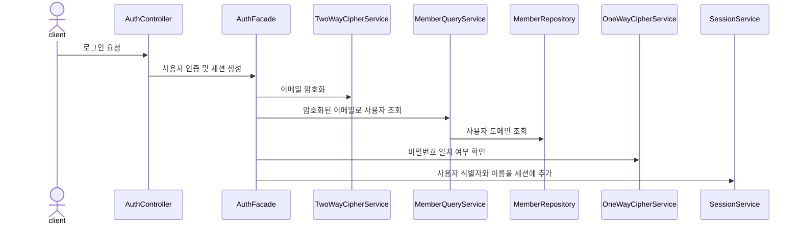
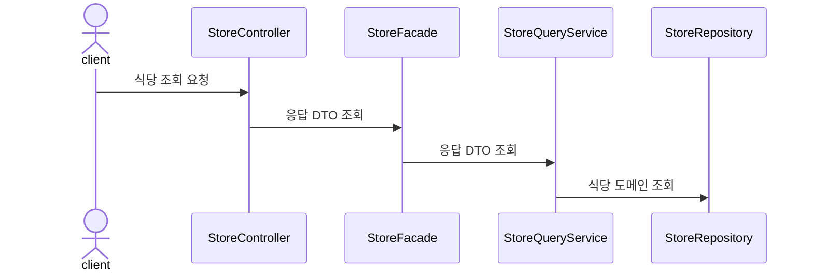
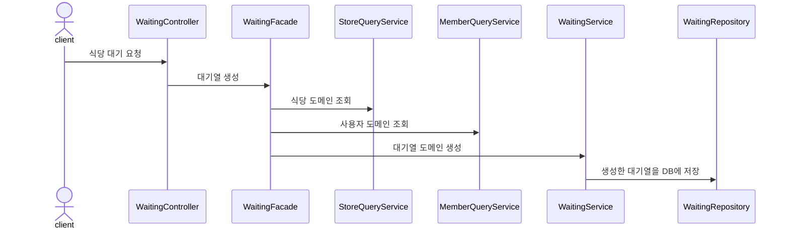

# 테이블링 서비스

**현장에서 직접 대기하지 않고, 식당에 대기 할 수 있는 서비스**

* 식당 이용객은 순서를 기다리기 위해 현장에서 대기하지 않아도 된다.
* 식당측은 간편하게 대기열을 관리할 수 있다.

 
 
 
 
 

## 기술 스택

* Backend: `Java 17`, `Spring Boot 3.1.3`, `Spring Data JPA`, `Spring Rest Docs`
* DevOps: `MySQL 8.2.0`, `Redis`, `Docker`, `Naver Cloud Platform`, `Prometheus`, `Grafana`, `Ngrinder`

 
 
 
 
 

## 인프라 아키텍처

 
 
 
 
 

## 시퀀스 다이어그램

### 로그인

### 식당 조회

### 식당 대기

 
 
 
 
 

## 프로젝트 컨벤션

* [객체지향 설계를 위한 규칙](https://github.com/f-lab-edu/tabling/wiki/Convention#객체지향-설계)
* [커밋 메시지 규칙](https://github.com/f-lab-edu/tabling/wiki/Convention#commit-message)
* [PR 규칙](https://github.com/f-lab-edu/tabling/wiki/Convention#pr-guideline)
* [코딩 스타일](https://github.com/f-lab-edu/tabling/wiki/Convention#java-coding-style)
* [빌더 패턴 규칙](https://github.com/f-lab-edu/tabling/wiki/Convention#builder-pattern)
* [브랜치 전략](https://github.com/f-lab-edu/tabling/wiki/브랜치-전략#github-flow)
* [유스케이스](https://github.com/f-lab-edu/tabling/wiki/유스-케이스)

 
 

## 문제 해결 및 성능 개선
* [식당 대기 시스템의 동시성 문제 해결 및 성능 개선](https://github.com/f-lab-edu/tabling/wiki/식당-대기-시스템의-동시성-문제-해결-및-성능-개선)
* [Java 21 마이그레이션 및 Virtual thread 성능 측정](https://github.com/f-lab-edu/tabling/wiki/Java-21-마이그레이션-및-Virtual-thread-성능-측정)

 
 

## 트레이드 오프 및 고찰
* [테스트 커버리지 비율 80%를 달성한 후 생긴 고민](https://github.com/f-lab-edu/tabling/wiki/테스트-커버리지-비율-80%25를-달성한-후-생긴-고민)
* [DTO 관리 전략: 외부 클래스와 정적 중접 클래스](https://github.com/f-lab-edu/tabling/wiki/DTO-관리-전략:-외부-클래스와-정적-중첩-클래스)

 
 
 
 
 

## ERD

 

 

* [DB 설계](https://github.com/f-lab-edu/tabling/wiki/DB-%EC%84%A4%EA%B3%84#datetime-vs-timestamp)

 
 

