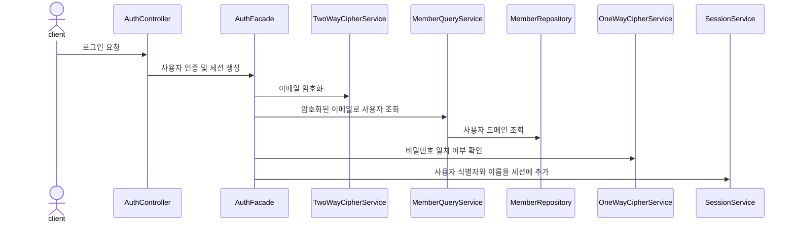
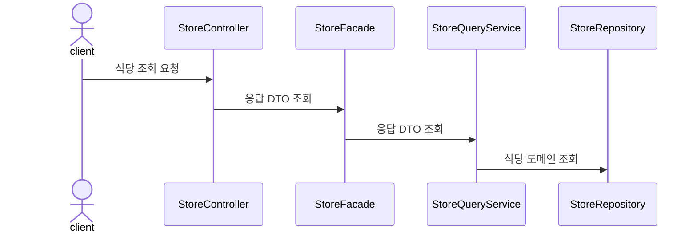
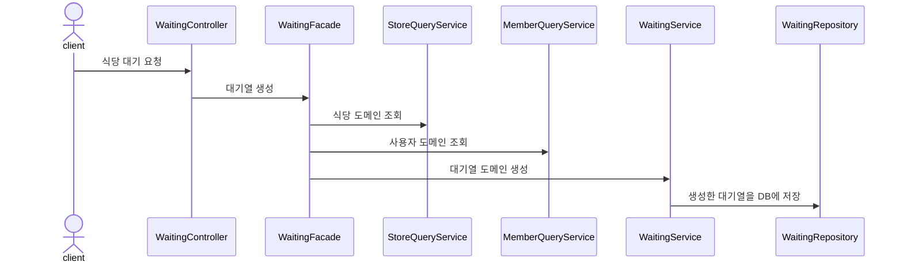

# 테이블링 서비스

웨이팅이 필요한 식당을 편리하게 이용할 수 있는 서비스입니다. 
식당 이용객은 순서를 기다리기 위해 현장에서 대기하지 않아도 되며, 식당측은 간편하게 대기열을 관리할 수 있습니다.

 
 

# 기술 스택

* Backend: Java 17, Spring Boot 3.1.3, Spring Data JPA, Spring Rest Docs
* DevOps: MySQL 8.2.0, Redis, Docker, Naver Cloud Platform, Prometheus, Grafana, Ngrinder

 
 

# 인프라 구조

## 서버 아키텍처

 
 

## CI/CD

 
 

# 주요 기능 시퀀스 다이어그램

### 로그인

### 식당 조회

### 식당 대기

 
 

## 브랜치 전략

* [테이블링 브랜치 전략](https://github.com/f-lab-edu/tabling/wiki/%EB%B8%8C%EB%9E%9C%EC%B9%98-%EC%A0%84%EB%9E%B5)

 
 

## 유스케이스

* [테이블링 유스케이스](https://github.com/f-lab-edu/tabling/wiki/%EC%9C%A0%EC%8A%A4-%EC%BC%80%EC%9D%B4%EC%8A%A4)

 
 

## API 명세

* [API 명세 Github 페이지](https://f-lab-edu.github.io/tabling/)

 
 

# ERD

 

 

* [DB 설계](https://github.com/f-lab-edu/tabling/wiki/DB-%EC%84%A4%EA%B3%84#datetime-vs-timestamp)

 
 

# 트러블 슈팅

* DTO 관리 방법에 대한 고찰: 책임과 기준
* 테스트 유효성과 픽스처 관리 방법에 대한 고민
* 올바른 Enum 통신 방법
* Spring Security 없이 세션 인증 구현 : 필터와 인터셉터
* 세션 저장소를 Redis로 바꾸게 된 이유
* 식당 대기큐에서 동시성 이슈 해결
* 성능테스트와 성능 개선

