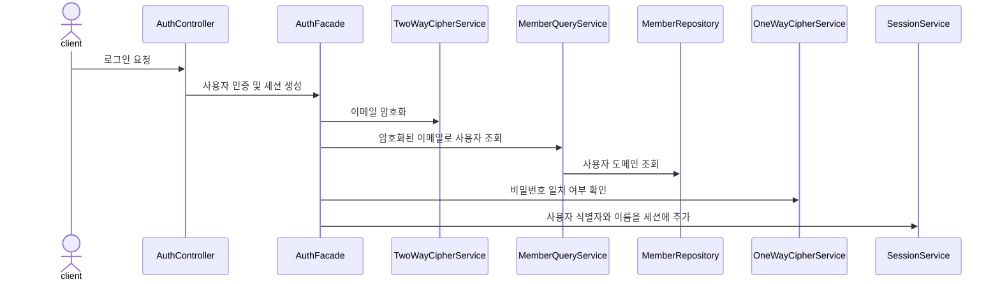
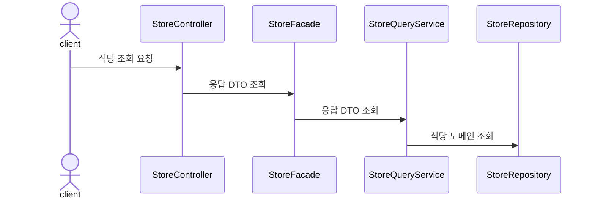
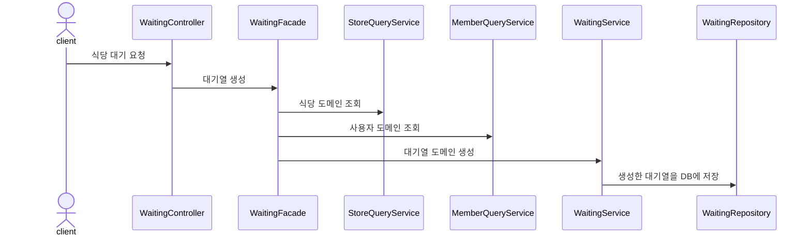

# 테이블링 서비스

웨이팅이 필요한 식당을 편리하게 이용할 수 있는 서비스입니다. 
식당 이용객은 순서를 기다리기 위해 현장에서 대기하지 않아도 되며, 식당측은 간편하게 대기열을 관리할 수 있습니다.

 
 

# 기술 스택

* Backend: Java 17, Spring Boot 3.1.3, Spring Data JPA, Spring Rest Docs
* DevOps: MySQL 8.2.0, Redis, Docker, Naver Cloud Platform, Prometheus, Grafana, Ngrinder

 
 

# 트러블 슈팅

* [올바른 Enum 사용으로 클라이언트에 의존하지 않는 API 설계](https://github.com/f-lab-edu/tabling/wiki/%ED%8A%B8%EB%A0%88%EC%9D%B4%EB%93%9C-%EC%98%A4%ED%94%84-%EB%B0%8F-%EA%B3%A0%EC%B0%B0#%EC%98%AC%EB%B0%94%EB%A5%B8-enum-%EC%82%AC%EC%9A%A9%EC%9C%BC%EB%A1%9C-%ED%81%B4%EB%9D%BC%EC%9D%B4%EC%96%B8%ED%8A%B8%EC%97%90-%EC%9D%98%EC%A1%B4%ED%95%98%EC%A7%80-%EC%95%8A%EB%8A%94-api-%EC%84%A4%EA%B3%84)
* [역할과 책임에 따른 DTO 관리 전략](https://github.com/f-lab-edu/tabling/wiki/%ED%8A%B8%EB%A0%88%EC%9D%B4%EB%93%9C-%EC%98%A4%ED%94%84-%EB%B0%8F-%EA%B3%A0%EC%B0%B0#%EC%97%AD%ED%95%A0%EA%B3%BC-%EC%B1%85%EC%9E%84%EC%97%90-%EB%94%B0%EB%A5%B8-dto-%EA%B4%80%EB%A6%AC-%EC%A0%84%EB%9E%B5)
* [단위 테스트와 통합 테스트 사이의 트레이드 오프](https://github.com/f-lab-edu/tabling/wiki/%ED%8A%B8%EB%A0%88%EC%9D%B4%EB%93%9C-%EC%98%A4%ED%94%84-%EB%B0%8F-%EA%B3%A0%EC%B0%B0#%EB%8B%A8%EC%9C%84-%ED%85%8C%EC%8A%A4%ED%8A%B8%EC%99%80-%ED%86%B5%ED%95%A9-%ED%85%8C%EC%8A%A4%ED%8A%B8-%EC%82%AC%EC%9D%B4%EC%9D%98-%ED%8A%B8%EB%A0%88%EC%9D%B4%EB%93%9C-%EC%98%A4%ED%94%84)
* [로그의 일관성과 명확성 사이의 트레이드 오프](https://github.com/f-lab-edu/tabling/wiki/%ED%8A%B8%EB%A0%88%EC%9D%B4%EB%93%9C-%EC%98%A4%ED%94%84-%EB%B0%8F-%EA%B3%A0%EC%B0%B0#%EB%A1%9C%EA%B7%B8%EC%9D%98-%EC%9D%BC%EA%B4%80%EC%84%B1%EA%B3%BC-%EB%AA%85%ED%99%95%EC%84%B1-%EC%82%AC%EC%9D%B4%EC%9D%98-%ED%8A%B8%EB%A0%88%EC%9D%B4%EB%93%9C-%EC%98%A4%ED%94%84)
* [Spring Security 없이 세션 인증 구현 : 필터를 선택해서 구현](https://github.com/f-lab-edu/tabling/wiki/%ED%8A%B8%EB%A0%88%EC%9D%B4%EB%93%9C-%EC%98%A4%ED%94%84-%EB%B0%8F-%EA%B3%A0%EC%B0%B0#spring-security-%EC%97%86%EC%9D%B4-%EC%84%B8%EC%85%98-%EC%9D%B8%EC%A6%9D-%EA%B5%AC%ED%98%84--%ED%95%84%ED%84%B0%EB%A5%BC-%EC%84%A0%ED%83%9D%ED%95%B4%EC%84%9C-%EA%B5%AC%ED%98%84)
* [세션 저장소를 Redis로 바꾸게 된 이유](https://github.com/f-lab-edu/tabling/wiki/%ED%8A%B8%EB%A0%88%EC%9D%B4%EB%93%9C-%EC%98%A4%ED%94%84-%EB%B0%8F-%EA%B3%A0%EC%B0%B0#%EC%84%B8%EC%85%98-%EC%A0%80%EC%9E%A5%EC%86%8C%EB%A5%BC-redis%EB%A1%9C-%EB%B0%94%EA%BE%B8%EA%B2%8C-%EB%90%9C-%EC%9D%B4%EC%9C%A0)
* [식당 대기열에서 동시성 이슈 해결](https://github.com/f-lab-edu/tabling/wiki/%ED%8A%B8%EB%A0%88%EC%9D%B4%EB%93%9C-%EC%98%A4%ED%94%84-%EB%B0%8F-%EA%B3%A0%EC%B0%B0#%EC%8B%9D%EB%8B%B9-%EB%8C%80%EA%B8%B0%EC%97%B4%EC%97%90%EC%84%9C-%EB%8F%99%EC%8B%9C%EC%84%B1-%EC%9D%B4%EC%8A%88-%ED%95%B4%EA%B2%B0)

 
 

# 인프라 구조

## 서버 아키텍처

 
 

## CI/CD

 
 

# 주요 기능 시퀀스 다이어그램

### 로그인

### 식당 조회

### 식당 대기

 
 

## 브랜치 전략

* [테이블링 브랜치 전략](https://github.com/f-lab-edu/tabling/wiki/%EB%B8%8C%EB%9E%9C%EC%B9%98-%EC%A0%84%EB%9E%B5)

 
 

## 유스케이스

* [테이블링 유스케이스](https://github.com/f-lab-edu/tabling/wiki/%EC%9C%A0%EC%8A%A4-%EC%BC%80%EC%9D%B4%EC%8A%A4)

 
 

## API 명세

* [API 명세 Github 페이지](https://f-lab-edu.github.io/tabling/)

 
 

# ERD

 

 

* [DB 설계](https://github.com/f-lab-edu/tabling/wiki/DB-%EC%84%A4%EA%B3%84#datetime-vs-timestamp)

 
 

